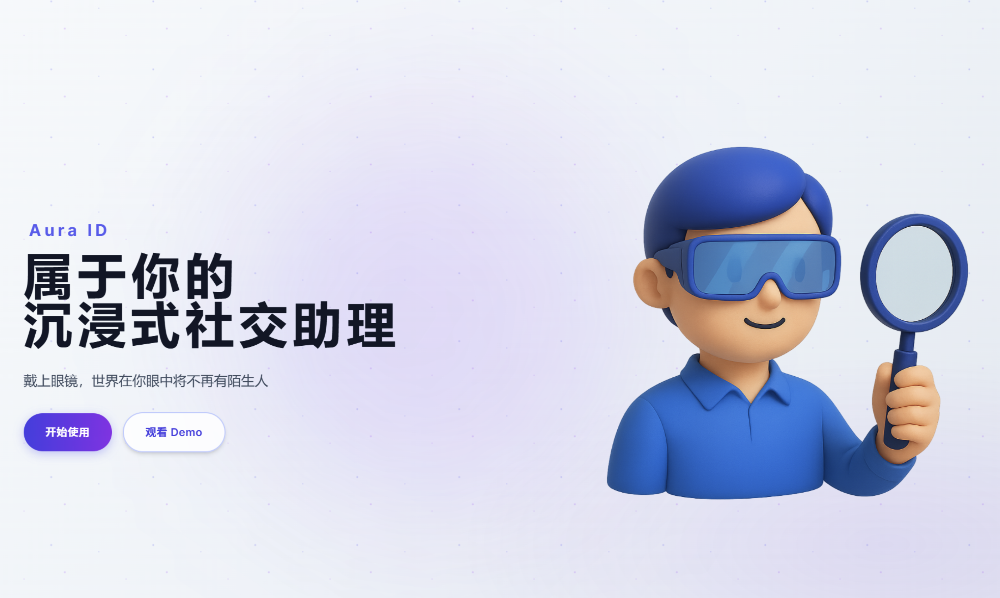
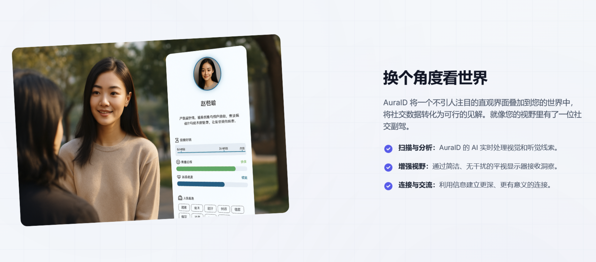

# AuraID: 你的MR智能社交助理

### **一句话简述**
AuraID为您解锁社交超能力，每一次交谈都得心应手的混合现实智能社交助手。

### **作品详细描述**

AuraID 是一款专为混合现实（MR）环境设计的社交辅助应用，旨在通过实时信息增强，帮助您轻松识别他人、理解情绪、回顾过往互动，并获得智能话题建议，让您的每一次社交都自信而流畅。

我们相信，科技的价值在于增进人与人之间的连接。在MR时代，信息可以更自然地与现实世界融合。AuraID 正是为此而生，它就像一个植入您脑海中的社交助手，将复杂的社交信息变得直观、即时，让您从容应对任何社交场合。

## **核心功能**

AuraID 通过头显的摄像头, 麦克风实时分析您面前的社交对象，并在您的视野中以非侵入式的方式叠加一层智能信息，为您提供前所未有的社交超能力。

#### 1. 👓 人脸识别与AI标签

告别“脸盲”的尴尬。AuraID 能够快速识别视野中的人物，并即时展示其关键信息。

* **基础信息识别**: 首次见面？AuraID 会提示这是“新朋友”。对于已经认识的人，它会立刻显示其姓名、上次见面时间等基本信息。

* **AI个人Tag生成**: 系统会根据过往的交流内容，利用大语言模型自动为您的朋友生成个性化标签，例如“科幻电影迷”、“喜欢徒步”或“创业伙伴”，帮助您快速回忆起对方的特点和共同话题。

#### 2. 😊 情绪与状态洞察

“读懂空气”不再是难题。AuraID 能够实时分析对方的微表情和图像信息，帮助您洞察其当前的情绪状态。

* **情绪仪表盘**: 以直观的进度条或图标显示对方当前的情绪状态，例如“放松”、“专注”或“紧张”。

* **话题晴雨表**: 根据对方的情绪反馈，系统会评估当前话题的接受度，帮助您判断是该深入探讨还是切换话题，让对话氛围更融洽。

#### 3. 🤝 互动历史回顾

每一次相遇都值得被记录。AuraID 会自动为您建立与每位朋友的互动档案。

* **见面次数与时间线**: 清晰记录您与某位朋友见面的总次数、上次见面的日期与地点。

* **熟悉度等级**: 系统会根据互动频率和时长，自动计算您与朋友的“熟悉程度”，从“陌生”到“挚友”，一目了然。

#### 4. 💡 AI智能话题建议

再也不用担心“尬聊”和“没话说”。当对话陷入停顿时，AuraID 的智能对话引擎会立刻介入。

* **上下文话题推荐**: 基于您和朋友的共同兴趣、过往聊天记录以及AI对当前场景的分析，为您推荐最合适的话题。

* **破冰提示**: 对于初次见面的朋友，系统会提供开放性的问题建议，帮助您轻松开启一段有意义的对话。

## **技术架构与实现**

Aura-ID 是一个典型的MR+AI应用，采用前后端分离的架构。前端负责在MR环境中进行实时数据采集与渲染，后端提供强大的AI分析与数据管理能力。

### **前端技术栈 (Client-Side)**

* **硬件平台**: **Meta Quest 3**。我们充分利用其强大的MR能力、彩色透视（Passthrough）功能和开放的生态系统作为应用载体。

* **软件开发**:

  * **Meta Spatial SDK**: 用于实现空间感知、场景理解、平面检测和MR交互的核心工具集，确保应用能够与真实世界无缝融合。

  * **Android 原生开发**: 为了最高效地获取数据，我们采用Android原生开发模式，实现对Meta Quest头显摄像头的系统级调用，以低延迟、高帧率的方式采集场景和语音数据。

* **数据采集**: 通过前端应用实时调用头显的摄像头和麦克风，捕获用户第一视角下的视频流和音频流，经过初步处理后发送至后端进行分析。

### **后端技术栈与服务 (Server-Side)**

后端通过一套RESTful API提供服务，集成了多种AI模型和数据管理功能。

* **多模态大模型**: 项目后端的核心是 **GPT-4o**。它被用于：

  * **视觉分析**: 通过`image_ai/analyze`接口，分析人物的情绪、年龄、性别、心情等，并提供独特的观察点（例如“他看起来有些疲惫”）。

  * **对话智能**: 通过`text-ai`系列接口，对转录后的对话文本进行摘要、标签生成和话题推荐，赋予应用“理解对话”的能力。

* **专用人脸分析模型**:

  * 通过`face/find`接口，实现高效、精准的人脸识别。该接口能够在海量数据库中快速检索匹配的人物，并返回其关联的个人档案。这比直接使用通用大模型进行身份识别更快速、成本更低。

* **语音识别 (ASR)**:

  * 通过`asr/transcriptions`接口，将前端采集的音频文件（如WAV, MP3等）转录为文本，为后续的文本分析提供干净的输入源。

* **核心数据管理**:

  * **用户档案 (`/profiles`)**: 提供对个人社交档案的完整CRUD（增删改查）操作，包括基础信息、详细信息以及会议记录的管理。

  * **认证 (`/auth`)**: 基于JWT Bearer Token的标准化用户认证体系，确保服务安全和用户数据隔离。

### **核心数据流 (Core Data Flow)**

1. **采集 (Capture)**: Quest 3上的MR应用捕捉到用户视野中的人物图像和对话音频。

2. **识别与分析 (Recognition & Analysis)**:

   * 图像帧被发送到后端的 **`/face/find`** 接口。

   * 后端人脸识别模型进行匹配。若匹配成功，则返回该人物的档案信息；若未找到，则可调用 **`/profiles/create`** 创建新档案。

   * 同时，图像被送入 **`/image_ai/analyze`** 接口，利用GPT-4o进行情绪、年龄、能量水平等多维度分析。

3. **转录与理解 (Transcription & Comprehension)**:

   * 音频流被发送到 **`/asr/transcriptions`** 接口，转换为文字。

   * 转录后的文本被送入 **`/text_ai/summary`**, **`/text_ai/tagging`**, **`/text_ai/topics`** 等接口，进行对话摘要、标签生成和话题推荐。

4. **呈现 (Presentation)**: 所有经过后端处理的结构化信息（如姓名、AI标签、情绪状态、话题建议等）被统一返回给前端MR应用。

5. **渲染 (Rendering)**: 前端应用将这些信息以UI面板、标签、进度条等形式，优雅地呈现在用户的MR视野中，完成一次完整的社交增强闭环。

## **后端API接口概览**

Aura-ID的后端服务围绕以下几个核心资源构建。所有接口均基于 `http://localhost:8000/api/v1`。

* **🔐 认证 (`/auth`)**

  * 提供用户注册、登录 (`/token`)、获取个人信息 (`/me`) 和查询使用统计 (`/stats`) 的功能。

* **👥 个人档案 (`/profiles`)**

  * 管理社交联系人的核心模块。支持创建、列出、查询、更新和删除个人档案。

  * 特别支持通过 `/add-meeting` 接口为指定用户添加会面记录。

* **🎯 人脸识别 (`/face`)**

  * 核心AI功能之一。接收上传的图片，在数据库中查找匹配的人物档案，并返回包含AI图像分析结果的详细信息。

* **🖼️ 图像AI (`/image-ai`)**

  * 封装了GPT-4o视觉能力和图像生成能力。

  * `/analyze`：对任意图片进行深度分析。

  * `/generate`：根据文本提示生成高质量图片。

* **🎤 语音识别 (`/asr`)**

  * 提供语音转文本服务，支持多种主流音频格式（WAV, MP3, M4A等）。

* **🤖 文本AI (`/text-ai`)**

  * 提供基于大语言模型的对话内容分析能力。

  * `/summary`：生成对话摘要。

  * `/tagging`：为对话内容生成关键词标签。

  * `/topics`：根据上下文推荐新的对话主题。

* **🏥 健康检查 (`/health`)**

  * 提供系统健康状态和详细性能指标的监控端点。
